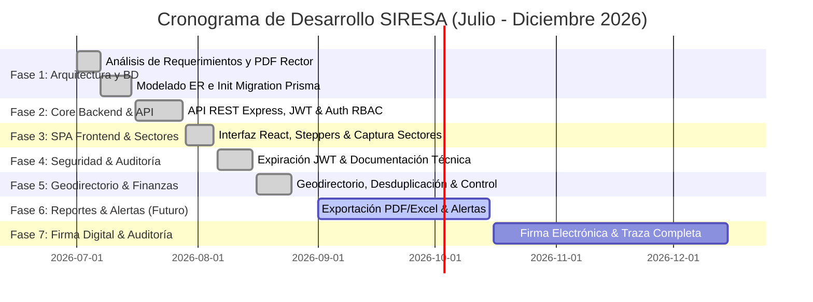

# Reporte Ejecutivo de Desarrollo y Evolución del Sistema — SIRESA
**Sistema de Registro de Información de la Secretaría de Desarrollo Rural de Nayarit**  
**Periodo Cobertura:** Julio – Diciembre 2026  
**Fecha de Emisión / Corte:** 25 de Agosto de 2026  
**Elaborado por:** Equipo de Desarrollo / Control de Versiones

---

## 1. Resumen Ejecutivo

El **Sistema de Registro de Información de la Secretaría de Desarrollo Rural de Nayarit (SIRESA)** es una plataforma web integral diseñada para la digitalización, control presupuestal, recepción y seguimiento de expedientes de apoyo al campo en el estado de Nayarit.

Este documento establece el **reporte cronológico de desarrollo**, detallando las etapas comprendidas entre **julio y diciembre de 2026**, divididas en:
1. **Fases Concluidas (Julio – Agosto 2026):** Arquitectura base, módulo de solicitudes de 5 sectores, seguridad JWT, geodirectorio y mesa de control.
2. **Fases Programadas (Septiembre – Diciembre 2026):** Exportación avanzada de reportes, alertas de estatus, firma digital y auditoría en tiempo real.

---

## 2. Etapas de Desarrollo y Cronograma Histórico (Julio – Agosto 2026)

---

### ETAPA 1: Análisis de Requerimientos, Modelado ER y Base de Datos
* **Periodo:** 01 al 15 de Julio de 2026
* **Hito Clave:** Migración Inicial de Prisma (`20260707163744_init` — 07/Jul/2026)
* **Objetivo & Justificación:** 
  Transformar los lineamientos físicos del documento rector `"SISTEMA DE REGISTRO DE INFORMACIÓN.pdf"` en una base de datos relacional PostgreSQL altamente optimizada y flexible.
* **Actividades Realizadas:**
  - Levantamiento de requisitos operativos de la SEDER.
  - Diseño del esquema relacional en Prisma ORM soportando 5 sectores productivos (*Agricultura Frijol, Ganadería, Pesca/Acuacultura, Infraestructura y Maquinaria*).
  - Creación del modelo de datos para padrón de productores, solicitudes, expedientes y usuarios.

---

### ETAPA 2: Desarrollo del Core Backend y Seguridad RBAC
* **Periodo:** 16 al 28 de Julio de 2026
* **Hito Clave:** Construcción del servidor Node.js + Express
* **Objetivo & Justificación:**
  Asegurar que todas las peticiones estén autenticadas y autorizadas según el nivel de jerarquía funcional del usuario.
* **Actividades Realizadas:**
  - Implementación de arquitectura por características (*Feature-Based Modules*).
  - Autenticación mediante tokens **JWT** y encriptación de contraseñas con **bcrypt**.
  - Control de Acceso Basado en Roles (**RBAC**) con 4 roles: `SUPERADMIN`, `ADMINISTRADOR`, `FUNCIONARIO` y `ANALISTA`.
  - Configuración del módulo de presupuestos sectoriales y middleware centralizado de errores.

---

### ETAPA 3: SPA Frontend, Formularios Sectoriales y Control de Expedientes
* **Periodo:** 29 de Julio al 05 de Agosto de 2026
* **Hito Clave:** Primer Commit de Repositorio (`fee029f` — 29/Jul/2026)
* **Objetivo & Justificación:**
  Dotar a los usuarios de una interfaz moderna, rápida y responsiva para la captura fluida de expedientes ruralless reduciendo errores de dedo.
* **Actividades Realizadas:**
  - Desarrollo de la Single Page Application (SPA) con **React 19, Vite y Tailwind CSS**.
  - Creación del *Stepper Horizontal* dinámico para el registro de solicitudes en 4 pasos.
  - Formulario dinámico adaptativo para los 5 sectores productivos.
  - Módulo de subida de archivos (PDF e imágenes) mediante `Multer`.
  - Dashboard interactivo con indicadores KPI (Recharts) y mapa interactivo regional de Nayarit (Leaflet).

---

### ETAPA 4: Fortalecimiento de Seguridad, Expiración de Sesión y Auditoría
* **Periodo:** 06 al 15 de Agosto de 2026
* **Hitos Clave:** Commits `d5454e9`, `8cba566`, `1bcdd9d`, `64ec668`
* **Objetivo & Justificación:**
  Cumplir con las normativas de seguridad institucional de información gubernamental.
* **Actividades Realizadas:**
  - Implementación de alertas preventivas de expiración de token JWT con renovación en caliente.
  - Sanitización de datos de entrada mediante validación estructurada con **Zod**.
  - Generación de documentación técnica oficial ([`schema.sql`](file:///c:/Users/gaddi/Documents/Dev/backend/base_de_datos_esquema/schema.sql) y guía de despliegue).

---

### ETAPA 5: Geodirectorio Rural, Unicidad de Beneficiarios y Mesa de Control
* **Periodo:** 16 al 25 de Agosto de 2026 (Estado Actual)
* **Hitos Clave:** Commits `053eed4`, `ea0c3cd`, `5a99837`, `9ec6b0a`, `9d287d7`
* **Objetivo & Justificación:**
  Garantizar la transparencia, eliminar duplicidad de apoyos y dar visibilidad ejecutiva al gasto público.
* **Actividades Realizadas:**
  - **Módulo de Geodirectorio Rural:** Geolocalización de productores con mapa interactivo y fichas detalladas de contacto.
  - **Desduplicación Automática:** Restricción de unicidad estricta para CURP y RFC a nivel base de datos y backend.
  - **Mesa de Control Financiera:** Consolidación en tiempo real del presupuesto asignado vs. invertido por sector.
  - **Optimización de UI/UX:** Mejora de contraste, legibilidad del Hero y responsividad completa de la barra de navegación (Navbar).

---

## 3. Hoja de Ruta Programada (Septiembre – Diciembre 2026)

Para completar el ciclo del desarrollo anual del sistema, se tienen programadas las siguientes fases:

| Etapa | Periodo Estimado | Funcionalidades y Entregables | Justificación Técnica / Operativa |
| :--- | :--- | :--- | :--- |
| **Etapa 6: Reportabilidad y Notificaciones** | **Sep – Oct 2026** | • Generador de reportes ejecutivos en PDF/Excel. • Módulo de notificaciones vía correo y SMS a productores. • Filtros avanzados por municipio y tipo de apoyo. | Facilitar la rendición de cuentas y mantener informados a los beneficiarios sobre el estatus de su trámite. |
| **Etapa 7: Firma Digital y Auditoría Completa** | **Oct – Nov 2026** | • Integración de Firma Electrónica para dictaminadores. • Módulo de traza de auditoría (*Audit Log*) por evento. • Respaldo automatizado de expediente digital. | Dar validez legal a los dictámenes expedidos y registrar cada acción dentro del sistema. |
| **Etapa 8: Cierre de Entrega y Capacitación** | **Dic 2026** | • Pruebas de carga y estrés. • Manuales de usuario final por rol. • Cierre de versión final v2.0.0 y entrega a producción. | Garantizar la estabilidad operativa y adopción del sistema por parte del personal de la SEDER. |

---

## 4. Registro Bitácora de Cambios a partir de Hoy

A partir del **25 de Agosto de 2026**, todo cambio en el código fuente, base de datos o interfaz será documentado estrictamente en:
* **Archivo de Bitácora:** [`CHANGELOG.md`](file:///c:/Users/gaddi/Documents/Dev/CHANGELOG.md)
* **Formato de Commits:** Conventional Commits (`feat:`, `fix:`, `docs:`, `style:`, `refactor:`, `test:`, `chore:`).
* **Control Semántico de Versiones:** Incremento reglamentado de versión (`v1.2.0` $\rightarrow$ `v1.2.1` / `v1.3.0`).

---
*Fin del Reporte Ejecutivo — SIRESA 2026*
